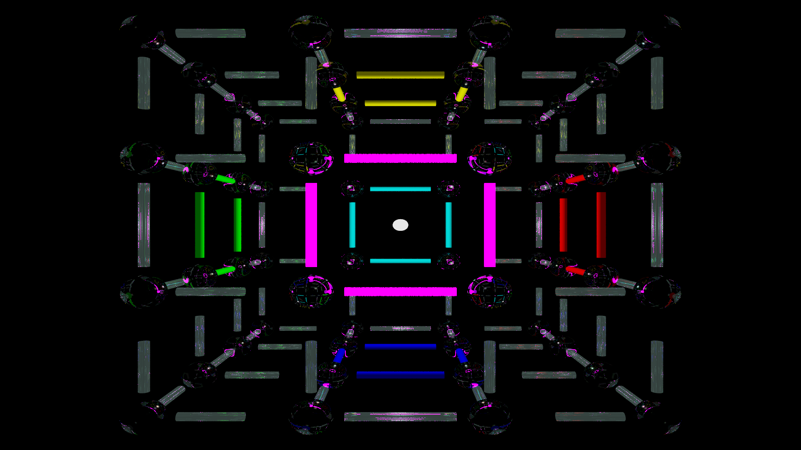
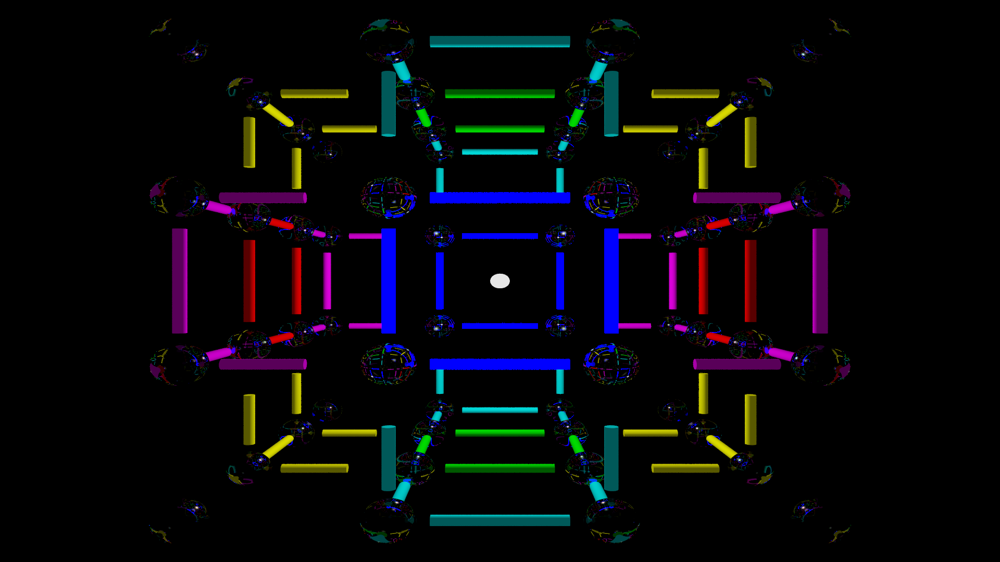
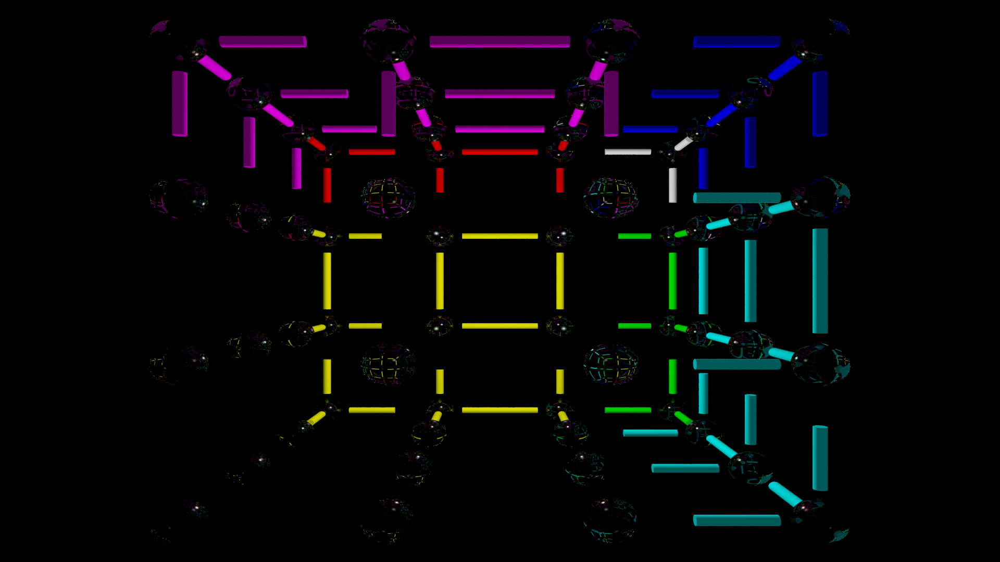
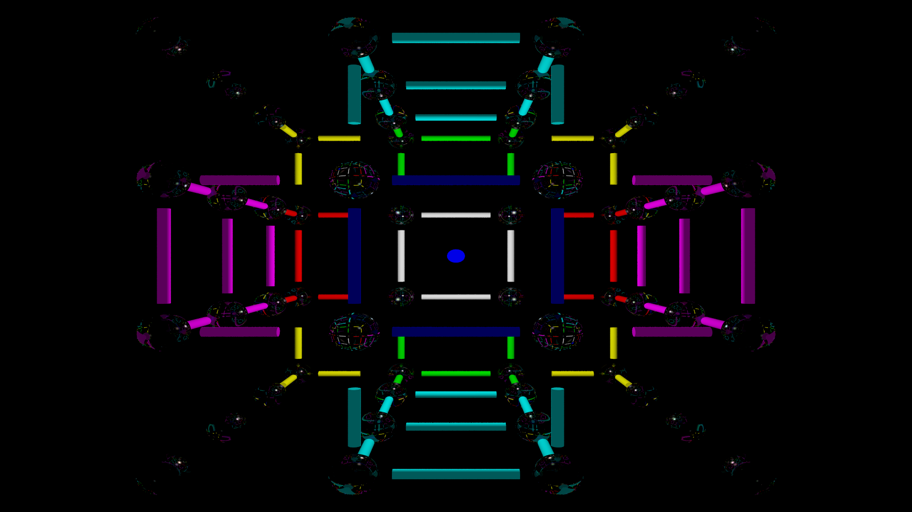
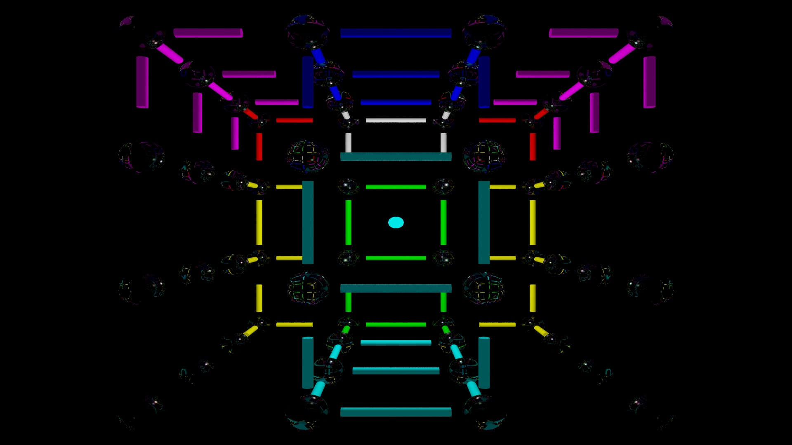

HMB-Entertainment proudly presents NZT - Take your memory to the next level! Do you want to feel limitless?

## Intro

**License**
- To protect your freedom and ensure that NZT remains free software, I choose to release NZT with the GNUv2 license. 

**Donate**
- If you love my work, I welcome a donation if you can afford it!
- Bitcoin  : 17emRoB1JpmAi8QsDwEpA1hsZ8srKfUKoh
- Ethereum : 0xE061D64a320EE32a0b31aaCD7BBCCd3632D958C0

**Contact**
- You can reach me at holdmybeer@protonmail.com. HMB-Entertainment welcomes your contributions to NZT!

## Abstract
The original N-back game illuminates a randomly selected square on a 3x3 tic tac toe board and asks the user to indicate when the current square matches the one shown "n" levels back. Dual N-back adds an auditory dimension to this game with a verbally indicated letter the user has to remember. Unlike single N-back, which trained only working memory, Dual N-back could increase fluid intelligence, previously seen as untrainable. Furthermore, cognitive gains from N-back transfer to other domains! 

NZT represents a purely visual 3D evolution of these games. I hope that it you find it vastly superiour to either of its predecessors as entertainment as well as brain food. 

## Installation

***These instructions will improve when I get installation feedback from a few friends***

1. Make Sure you have pip installed and install PyGame

- pip install pygame

2. Clone the repository using git clone

3. run nzt.py using python version 2

- python code/nzt.py

## Gameplay
For standard gameplay, programmers and typists will appreciate that the four fingers rest gently on the home row keys: "a s d f j k l ;". DON'T PANIC, they will not have to move.

By default, NZT will start at level 1. You only have to indicate the relationship the current element bears to the one that was previously displayed. NZT will communicate your input back to you by playing a single musical note. You have seven possible options. x, y, z, xy, xz, yz, xyz, as well as an eighth "No Relationship" option. Again, DON'T PANIC - by default you have 30 seconds to decide. 

At half-time (in this case 15 seconds) a wavering warble tune will indicate that you should select a final answer soon. After the next item appears, you will hear either a happy tune in a major key to indicate your success, or a descending chromatic cascade to indiate a wrong key. 

**Different Scenarios**

0 - Evaluate these scenarios one after another.

1 - If you see the same element, choose xyz.

2 - If the element occurs in the same axis (x = Horizontal, y = Vertical, or z = Depth) choose that axis.

3 - If the element occurs in the same plane, choose the plane defined by the cross product of the 2 axes it contains. 

4 - If the element satisfies neither of these three conditions, then there exists no relationship.  

- 'a' -> no relationship -> low A // BLACK
- 's' -> x axis -> B // RED
- 'd' -> y axix -> C // GREEN
- 'f' -> z axis -> D // BLUE
- 'j' -> xy plane -> E // YELLOW
- 'k' -> zx plane -> F // MAGENTA
- 'l' -> zy plane -> G // CYAN
- ';' -> xyz -> same element -> high A // WHITE

If this terse explanation causes your eyes to glaze over, DON'T PANIC. A visual explanation using rules of RGB additive synthesis illustrates the relationship between elements. 

CENTER 

CORNER

FACE

EDGE

## Technical Features

*Hardcoded constants*
- This lets me keep things simple to focus on proof of concept and enables rapid prototyping. I'd love to implement this later as an accessor class module. 

*Purely visual interface*
- When I play NZT in 3D, I enter a flow state and let my brain provide the answer. In a way I strive to replicate meditaton. Meditation requires internal awareness to determine if you meditate correctly. A guru can't see into your mind, while a gymnastics teacher can see errors in form and technique. NZT will provide imemdiate feedback if you lose focus. Although people may have different techniques for representing the elements in working memory, the game feedback provides a degree of objectivity. 
- I value the flow state with utmost importance because of its fragility. Having to click something on the screen, popups, and shifting colours can break this for me. I elected for music tones to indicate user input and feedback so that the visual system could enter a flow state. 
- I felt inspired to design it this way after watching a Youtube video where Richard Feynman performed experiments in college with a friend and realized that Visual and Auditory systems work independently. 

*UI Design theory*
- The fingers resting on the home row keys indicate all of these options in a way that balances the load on the left and right hands according to probability.
- The low a is most likely while the high a is least likely. The remaining keys in the home row are set the opposite way.
- NZT indicates half-time via a tenuous warble that elicits an uncertain feeling. 
- NZT indicates failure via a sad chromatic descent. 
- NZT indicates success via a happy major scale. 
- The keys "a s d f j k l ;" when played in succesion will play out an A natural minor scale.
- There exists, quite literally harmony at the interface. 

*Ray Tracing*
- Originally I tried using turtle but it fell immensely short of my standards.
- Paul Grahm's ANSI Common Lisp inspired me to consider Ray Tracing.
- Pov-ray install needed to run .pov files to make your own images.

*Music Generation*
- I designed the tunes from my own musical intuition.
- Haskell enables me to express the tune with maximum ease and clarity. 
- You will need to install GHC (Gargantuan Haskell Compiler) and Euterpea to make custom tunes. 

*Probabalistic Balance*
- Single N-back only has a 1/9 probability of matching the previous element. Without random weighting, this results in a very boring game. 
- NZT is inherently balanced and dynamic, with a probability of 19/27 (slightly higher than 2/3) of matching the previous element in one of seven ways. This results in a much more varied game compared to Single N-back.

*Ranking System* 
- Advancement should feel like achievement! 
- Different colors represent different levels. I cannot upload all the pictures due to github repository size restrictions. I will make a git commit with the code for the functionality when I have a shell script for autogeneration. 
- Level 1 = White. Simple enough. Fairly boring at this level. In a Go style ranking, I call this at 128 Kyu. 
- Levels [2..8] = [Red..Violet], Kyu = [2^x|x<-[6,5..0]]. I would probably feel pretty awesome having gone through all the colors! NZT has a surprise in store. 
- Levels [9..] = Black, Dan = [1..] Awareness of abscense does not indicate abscence of awareness. At this level you have to go past the color to mould your awareness to notice the disappearance.

### Epilogue
This project took much more time than I anticipated. I figured it would serve as a great way to jump into programming for the first time. I'd never made anything before. However this idea called to me, imploring me to will it into existence. It would not stop haunting me until I did. What a journey! 

I figured it would take me a few weeks to get it to version 0. After spending far more time than I care to admit, I ended up learning more than I bargained. As I pondered and implemented various ideas I learned about python, pygame, linux, bash, regular expressions, text editors, window managers, antialiasing, jitter, haskell, dependency hell, euterpea, git, benefits of commenting code, as well as balancing my wish for perfection with the neccesity of execution. It took enourmous will to fight the forces of entropy as they threw obstacle after obstacle in my path. =D

I'd like to offer special thanks to Gwern for inspiring this project by mentioning this idea on his fantastic site. https://www.gwern.net/ 

Secondly, I'd like to thank my friend Greg for using his wizardry of Grep,Sed, and Awk in creating invaluable templates for automatic generation of images.

If you like NZT, or see a way to make it better, consider contributing! Let me know your thoughts at holdmybeer@protonmail.com. Here are some ideas. 

### Features to Add
I would love contributions to continue making NZT a more elegant game for elite memory enhancement. Here is a list of features to implement later rated from 1 to 3 stars according to difficulty. 

Screencast *
 - Planning a screencast soon! An engaging one would serve as a great way to show new users how to get started and resolve any confusion with the presentation of the interface in the readme. 
 
Auto Image Generation *
- Planning to create a shell script integrating templates to automatically generate high quality 3D images on the user's computer. This will give users the highest resolution images possible and bypass github size restrictions. Also makes for a more elegant and extensible program enabling anyone to easily modify NZT to suit their style of gameplay. 

3D Support *
- NZT is currently compatible with 3D and has been successfully tested with it on multiple systems. 3D images are not included with the initial release. However, if this feature has sufficient demand, this represents the next logical extension.

Refactor Code *
- Priority was creating a minimum viable product. With proof of concept done, improving existing code takes less effort. I used an egregious collection of if statements in the game loop, however I am new to Python and am unsure how to clean this up without lisp macros. 

Backwards compatibility with N-Back and Dual N-Back *
- Using the existing sounds and povray code generate simpler images that are a subset of a cube and execute N-back and Dual N-back

MIDI Support **
- PyGame is incompatible with MIDI files so I wrote a shell script to convert them to mp3.
- Perhaps increasing the bitrate might solve this, but auditory static noise occurs at the beginning of any sound.
- Personally, I want this gone, however, some may find it pleasant. It kind of resembles a keyboard click. Sort of. 

Logging and Statistics package **
- Log user data as CSV file and have separate python program to load user statistics and graphically display them to display progress over time. Perhaps have it pay attention to aspects of the game the user is strong and weak at and offer advice accordingly.

GUI Interface **
- Currently gameplay settings are hardcoded for simplicity. However, having a gui interface that could be accessed would allow the game to reach many more people. This would also allow the game to be packaged as a binary and easily run on Mac, Windows, or phones. 

FPS game support *** 
- Unsure how this would work. Add different guns that would selectively kill blocks. Objective is to 'kill' the piece n turns back. If you remember the exact piece, sniper would kill it instantly. If not, other weapons such as shotgun would have area of effect and would take down shields. Only with shields down can you see if the piece is the correct one. Food for thought! =D

Quaternion Rotations ***
- A setting with perhaps lower quality but a rotating cube would add yet another dimension to NZT! Quaternions could represent these computations in a stable and fast manner while preserving quality. Algorithm thoughts : generate images prior to the game, and use them to approximate intermediate images thus mostly preserving quality. Gameplay options reduced to four as the user already has to remember a rotating structure : Same element, same axis, same plane, No Match. 
